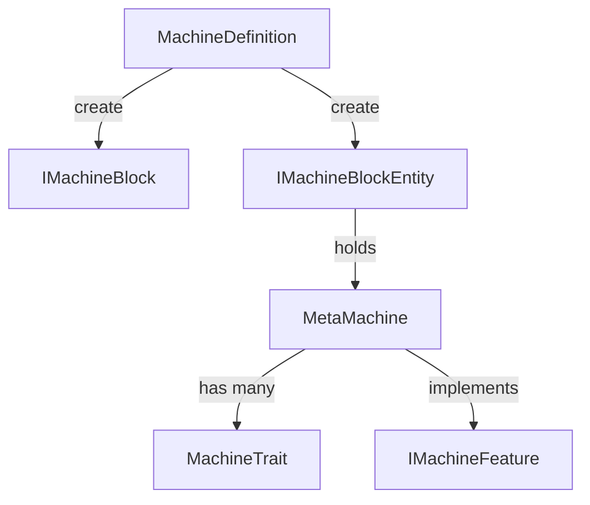

# 通用机器系统

BreakdownKernel 的机器系统基于 `MachineDefinition` 统一管理机器的方块、方块实体、渲染和 Tick 行为，通过 `MachineTrait`
组合模式实现功能复用。

## 架构总览

```
MachineDefinition（机器定义）
  ├─ IMachineBlock（机器方块）
  ├─ IMachineBlockEntity（机器方块实体）
  ├─ MetaMachine（机器逻辑基类）
  ├─ MachineTrait（机器特性）
  └─ IMachineFeature（机器功能接口）
```



## 核心概念

### MachineDefinition

机器的核心定义，包含方块属性、方块实体类型、GUI 工厂、渲染器等。通过 Builder 模式创建：

```java
MachineDefinition<SimpleMachine> simpleMachine = new MachineDefinition.Builder<>("simple_machine")
        .blockProperties(BlockBehaviour.Properties.of().strength(3.0f))
        .machineFactory(SimpleMachine::new)
        .buildAndRegister();
```

### MetaMachine

所有机器的逻辑基类，承载 MachineTrait 列表和生命周期管理：

| 生命周期方法          | 触发时机     |
|-----------------------|--------------|
| `onFirstTick()`       | 首个 tick    |
| `onMachineTick()`     | 每 tick      |
| `onMachineRemoved()`  | 机器被移除   |
| `onNeighborChanged()` | 相邻方块变化 |

### MachineTrait

通过组合模式为机器添加功能。内置常用 Trait：

| Trait              | 功能             |
|--------------------|------------------|
| `EnergyTrait`      | 能量存储与传输   |
| `FluidTankTrait`   | 流体存储         |
| `ItemHandlerTrait` | 物品输入输出     |
| `RecipeLogicTrait` | 配方处理         |
| `ProgressTrait`    | 进度条与工作状态 |
| `CoverableTrait`   | 覆盖板支持       |

### IMachineFeature

功能标记接口，用于类型安全地访问机器能力：

```java
if (machine instanceof IEnergyMachine energyMachine) {
    energyMachine.getEnergyStorage().receiveEnergy(100, false);
}
```

## 子模块

- **[相变能量系统](machine/phase-energy)** — 统一的能量 API，支持有线和无线传输
- **[多方块机器系统](machine/multiblock)** — 多方块结构定义、成型检测与渲染
