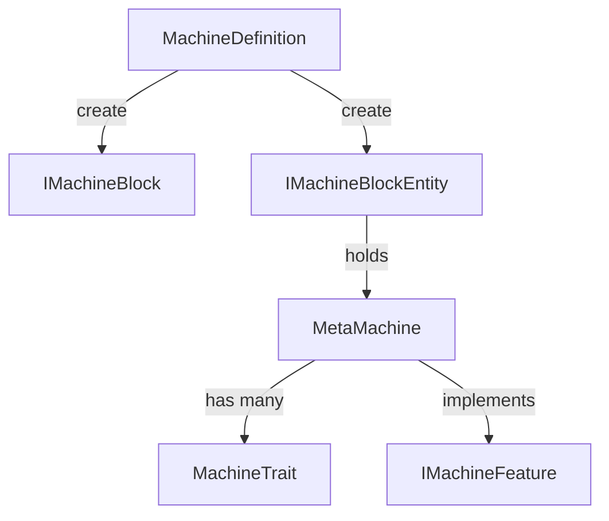

# 机器与多方块系统

BreakdownKernel 提供了灵活的机器定义框架。机器的方块、方块实体、渲染、Tick 行为均通过 `MachineDefinition` 统一管理。

## 架构总览

```
MachineDefinition（机器定义）
  ├─ IMachineBlock（机器方块）
  ├─ IMachineBlockEntity（机器方块实体）
  ├─ MetaMachine（机器逻辑基类）
  └─ MachineTrait（机器特性）
```



## 核心类

### MachineDefinition

机器定义的构建器，统一管理方块、物品、渲染器等。

```java
MachineDefinition def = MachineDefinition.createDefinition(
    Identifier.of("your_mod", "your_machine")
);
def.setMachineSupplier(YourMachine::new);
def.setRenderer(yourRenderer);
```

| 配置项                      | 说明               |
|--------------------------|------------------|
| `setBlockSupplier`       | 自定义方块提供者         |
| `setItemSupplier`        | 自定义物品提供者         |
| `setMachineSupplier`     | MetaMachine 工厂方法 |
| `setRenderer`            | 自定义渲染器           |
| `setShape`               | 碰撞箱形状            |
| `setAllowExtendedFacing` | 是否允许向上放置         |

### MetaMachine

所有机器的逻辑基类。实现了多个 feature 接口，支持 Tick 订阅、染色、红石信号等。

关键能力：

- **Tick 订阅** — 通过 `ITickSubscription` 动态管理 server tick
- **数据同步** — 基于 LDLib2 的 `@DescSynced` / `@Persisted` 注解
- **特性系统** — `MachineTrait` 列表，每个 trait 独立管理数据持久化和能力
- **所有者系统** — `MachineOwner` / `PlayerOwner` 管理机器归属

### MachineTrait

机器的模块化特性组件。每个 trait 拥有独立的同步存储和能力过滤。

```java
public class EnergyTrait extends MachineTrait {
    public EnergyTrait(MetaMachine machine) {
        super(machine);
    }

    @Override
    public void onMachineLoad() { /* 加载逻辑 */ }

    @Override
    public void onMachineUnLoad() { /* 卸载逻辑 */ }
}
```

通过 `capabilityValidator` 控制哪些面暴露能力。

### IMachineFeature

机器功能的接口标记，所有 feature 均继承此接口：

| Feature 接口               | 用途         |
|--------------------------|------------|
| `IDropSaveMachine`       | 破坏时保存数据到物品 |
| `IMachineLife`           | 机器生命周期回调   |
| `IMachineModifyDrops`    | 自定义掉落物     |
| `IRedstoneSignalMachine` | 红石信号交互     |
| `IUIMachine`             | UI 界面支持    |

## 多方块结构

> 多方块结构框架正在规划中，将通过数据驱动方式支持 JSON 定义的多方块机器。

## 相关页面

- [通用材料系统](material/index.md) — 材料定义
- [相变能量系统](phase-energy.md) — 能量 API
- [API 参考](api-reference.md) — 完整接口
