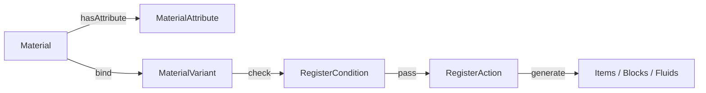

# 通用材料系统

通用材料系统由多个相互解耦的模块组成，核心思想是 **一次定义材料，自动生成全部变体**。对材料的任意操作会影响该种类下的所有物品。

## 架构总览

```
Material（材料定义）
  ├─ MaterialAttribute（材料属性）
  ├─ MaterialVariant（材料变体）
  ├─ RegisterCondition（注册条件）
  └─ RegisterAction（注册动作）
```



## 核心类

### Material

材料本体，只能通过 `new Material.Builder("name")` 创建。

```java
Material aluminium = new Material.Builder("aluminium")
        .ingot()          // 添加 INGOT 属性
        .fluid()          // 添加 FLUID 属性
        .color(0x7db9d8)  // RGB 颜色
        .element(Element.AL)
        .formula("Al")
        .build();
```

| Builder 方法                | 说明               |
|-----------------------------|--------------------|
| `.ingot()`                  | 标记为金属锭材料   |
| `.gem()`                    | 标记为宝石材料     |
| `.fluid()`                  | 标记为可流体化材料 |
| `.color(int)`               | 设置材料颜色       |
| `.element(Element)`         | 绑定化学元素       |
| `.formula(String)`          | 设置化学式         |
| `.components(Material... )` | 设置组分材料       |

### MaterialAttribute

材料属性的定义接口，决定材料「能做什么」。

| 属性类型  | 接口               | 说明                                |
|-----------|--------------------|-------------------------------------|
| `GENERAL` | `GeneralAttribute` | 通用属性：挖掘等级（0-3）、燃烧时间 |
| `INGOT`   | `IngotAttribute`   | 金属锭属性                          |
| `GEM`     | `GemAttribute`     | 宝石属性                            |
| `FLUID`   | `FluidAttribute`   | 流体属性（可带桶、可流动）          |

可重写方法进行可加性验证和格式化生成前置属性。

### MaterialVariant

材料变体的定义。每个变体对应一系列材料实例（流体、方块、物品、桶等）。

| 变体     | 物量 | 需求属性     |
|----------|------|--------------|
| `ingot`  | M    | INGOT        |
| `nugget` | M/9  | INGOT        |
| `dust`   | M    | GENERAL      |
| `block`  | 9M   | INGOT 或 GEM |
| `liquid` | M    | FLUID        |
| `melt`   | M    | FLUID        |

> **M** = 3,628,800（高可整除值，便于配方计算）

### RegisterCondition

函数式接口，用于注册时检测变体能否用于特定材料。

```java
// 示例：只有含 INGOT 属性的材料才生成锭
RegisterCondition generateIngot =
        (Material m) -> m.hasAttribute(AttributeType.INGOT);
```

多个条件同时设置时， **全部满足**才执行注册。

### RegisterAction

函数式接口，执行具体注册逻辑。通过 MaterialVariant 和 Material 格式化数据。

```java
// 示例：注册通用物品
RegisterAction generalItem = (registrate, variant, material) ->
                registrate.item(
                        variant.idPattern.formatted(material.getName()),
                        MaterialItem::new
                ).register();
```

## 属性系统

`AttributeType<T>` 提供类型安全的属性注册：

```java
public static final AttributeType<GeneralAttribute> GENERAL =
        AttributeType.register("general", GeneralAttribute.class);
public static final AttributeType<IngotAttribute> INGOT =
        AttributeType.register("ingot", IngotAttribute.class);
public static final AttributeType<GemAttribute> GEM =
        AttributeType.register("gem", GemAttribute.class);
public static final AttributeType<FluidAttribute> FLUID =
        AttributeType.register("fluid", FluidAttribute.class);
```

## 材料分类

| 类别                        | 说明                               |
|-----------------------------|------------------------------------|
| ElementMaterials            | 118+ 周期表元素                    |
| FirstDegreeMaterials        | 氧化物、硫化物、氯化物等一级化合物 |
| SecondDegreeMaterials       | 常见二级化合物                     |
| HigherDegreeMaterials       | 复杂高级化合物                     |
| OrganicChemistryMaterials   | 有机化合物                         |
| UnknownCompositionMaterials | 未知成分占位材料                   |
| MarkerMaterials             | 内部引用标记材料                   |
